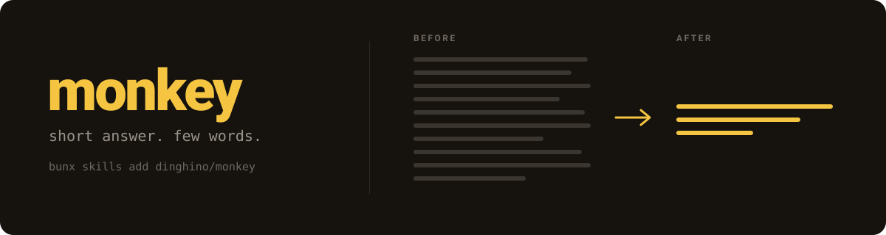

<p align="center">
  
</p>

# monkey

A Claude skill that makes the agent talk like a monkey. Short words. No essay.

Agents default to explaining. `monkey` turns that off: you get the answer, not the
lecture around it. The work stays as careful as it was — only the talking changes.

This matters most in long sessions. Three hours in, a paragraph of preamble on a
yes/no question is a tax on attention you don't have left to pay. Short replies
keep the session readable.

## Install

```bash
bunx skills add dinghino/monkey
```

<details>
<summary>npm / pnpm / yarn</summary>

```bash
npx skills add dinghino/monkey
pnpm dlx skills add dinghino/monkey
yarn dlx skills add dinghino/monkey
```

</details>

Add `-g` to install for every project, `-y` to skip the prompts.

## Use

Say any of these and the skill loads:

> monkey mode · go monkey · be monkey · monkey talk

It also loads on its own when you tell the agent to stop being wordy, technical,
or to quit overexplaining.

Say **stop**, **normal**, or start a new chat to leave.

## What changes

**Before**

> Great question! There are a few ways to approach this. The most idiomatic
> solution in modern JavaScript is to use `Array.prototype.at()`, which was
> introduced in ES2022 and accepts negative indices, making it cleaner than the
> traditional `arr[arr.length - 1]` pattern. Here's how you'd use it: …

**After**

> `arr.at(-1)`

Ask "why" or "explain" and monkey says more — still simple.

## Real example

Same question — *explain `git reset`* — answered by the same model, once normally and once
in monkey mode. Nothing here is padded on purpose; the long one is just what comes out by
default.

For scale: git's own [`git reset` man page][reset] is **23,832 characters**. Accurate,
complete, and almost nobody finishes it.

<details>
<summary><b>Normal</b> — 3,165 characters</summary>

The thing that makes `reset` confusing is that it does two unrelated jobs depending on
whether you give it a path, and most explanations don't separate them.

##### The three trees

Git tracks your work in three places at once:

| | Name | What it is |
|---|---|---|
| 1 | **HEAD** | The commit you're currently on — the last committed snapshot |
| 2 | **Index** (staging area) | What will go into your *next* commit |
| 3 | **Working tree** | The actual files on disk that your editor sees |

Normal flow moves changes upward: you edit the working tree, `git add` copies into the
index, `git commit` copies the index into a new commit and moves HEAD to it. `git reset`
moves things back down, and the flag decides how far down the change propagates.

##### Form 1: `git reset [--soft|--mixed|--hard] <commit>`

This moves your branch pointer to `<commit>`. The flag controls which of the three trees
follow it there:

| Flag | HEAD moves | Index reset | Working tree touched |
|---|---|---|---|
| `--soft` | ✅ | ❌ | ❌ |
| `--mixed` *(default)* | ✅ | ✅ | ❌ |
| `--hard` | ✅ | ✅ | ✅ |

Read it as a dial with three notches. Each flag does everything the one above it does,
plus one more layer.

- **`--soft`** — move the pointer, change nothing else. Your changes from the discarded
  commits are still staged, ready to re-commit. This is how you squash:
  `git reset --soft HEAD~5 && git commit` turns five commits into one.
- **`--mixed`** — also clear the index. Changes are still in your files, just unstaged.
  This is the default, and it's what you want when you committed too early and want to
  re-stage things differently.
- **`--hard`** — also overwrite your files. **This destroys uncommitted work with no
  undo.** It's the only genuinely dangerous form.

There are two more you'll rarely need: `--merge` and `--keep`, which try to move HEAD
while preserving your local modifications, refusing rather than clobbering when they
conflict.

##### Form 2: `git reset <paths>`

If you name a path, **HEAD does not move at all.** This form only copies files from HEAD
back into the index — meaning it unstages them:

```bash
git add .
git reset src/secrets.env    # oops, unstage just that one
```

Modern Git prefers `git restore --staged <path>` for exactly this, because splitting the
two behaviors into different commands was the fix for the confusion.

##### Choosing between the neighbors

- **`git reset`** rewrites history. Fine on local commits, hostile on anything you've
  pushed — collaborators' history diverges from yours.
- **`git revert`** creates a *new* commit that undoes an old one. History stays intact,
  so this is the correct choice for anything already pushed.
- **`git restore`** changes file contents without touching commits.
- **`git checkout`** used to do all three jobs, which is why it was so confusing;
  `switch` and `restore` split it up.

##### If you `--hard` by mistake

Committed work is almost always recoverable — the commits still exist, only the pointer
moved:

```bash
git reflog                    # find the SHA you were on
git reset --hard <that-sha>
```

Uncommitted work destroyed by `--hard` is genuinely gone.

</details>

**Monkey** — 623 characters:

---

three things in git: **HEAD** (where you are), the **index** (what is staged), the
**working tree** (your actual files).

`reset` move HEAD. the flag say how much else get dragged along.

```bash
git reset --soft  HEAD~1   # HEAD move. staged keep.  files keep.
git reset         HEAD~1   # HEAD move. staged wiped. files keep.   (default, --mixed)
git reset --hard  HEAD~1   # HEAD move. staged wiped. files GONE.
```

only `--hard` eat your work. other two safe.

- undo last commit, keep the code → `--soft`
- unstage one file → `git reset file.txt` (no commit move)
- `--hard` delete uncommitted work. no undo. careful.

---

Both correct. One of them you read.

[reset]: https://git-scm.com/docs/git-reset

## Development

```bash
bun run validate   # checks frontmatter and skills.sh.json
```

Skills live in `skills/<name>/SKILL.md`. `skills.sh.json` groups them on the
repo's [skills.sh](https://skills.sh) page.

## License

MIT
